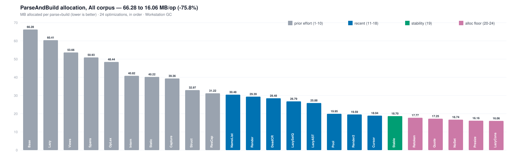
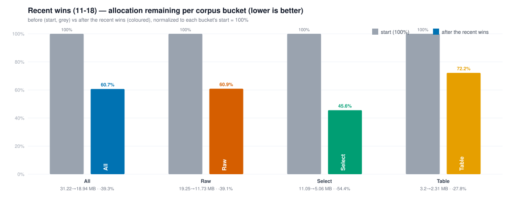

# Parser Performance — Allocation Reduction

**Headline: the pgproj parser now allocates `18.94 MB/op` to parse + build the corpus, down from `66.28 MB/op` — a `−71.4%` cut in managed allocations across 18 merged optimizations.**

Metric: **BenchmarkDotNet `PipelineBenchmarks.ParseAndBuild` allocated bytes/op (MB, lower is better)** over a corpus of PostgreSQL DDL/DML. Allocation is the deterministic, reportable number; wall-clock is omitted as noise (see [Caveats](#caveats)).

---

## 1. The full journey — "All" corpus bucket

Every merged optimization, in order. Allocation falls monotonically from baseline to the latest win.

> **Two efforts in one line.** Wins **1–10 (`Base` → `ResCap`)** were a prior effort that took allocation from `66.28` to `31.22 MB/op`. Wins **11–18 (`NameList` → `Cursor`)** are the recent effort, taking it the rest of the way to `18.94 MB/op` — an additional `−39.3%` on top of an already-optimized parser. The single biggest step is the `Pool` win (`25.88 → 19.95`, `−22.9%` in one move).

| Effort | Stages | Start → End (MB/op) | Reduction |
|---|---|---:|---:|
| Prior effort | `Base` → `ResCap` (1–10) | 66.28 → 31.22 | −52.9% |
| **Recent effort** | `NameList` → `Cursor` (11–18) | 31.22 → 18.94 | **−39.3%** |
| **Total** | `Base` → `Cursor` (1–18) | **66.28 → 18.94** | **−71.4%** |

---

## 2. Recent effort across all four corpus buckets

The recent wins (11–18) improved **every workload shape**, not just the aggregate. The four buckets' absolute magnitudes differ by ~10× (`All` ≈ 31 MB vs `Table` ≈ 3 MB), so each is shown as **before (start) vs after the recent wins, normalized to its own start = 100%** — the shorter the coloured bar, the bigger the reduction.

Each coloured bar is the allocation **remaining** after the recent wins, as a % of that bucket's start (lower = better): `Select` 46% · `All` 61% · `Raw` 61% · `Table` 72%. `Select` benefits most (lazy clause lists + pooling hit it hardest); `Table` is already lean so it moves least.

Absolute MB/op behind the normalized chart:

| stage | All | Raw | Select | Table |
|---|---:|---:|---:|---:|
| start (#10) | 31.22 | 19.25 | 11.09 | 3.20 |
| NameList | 30.48 | 18.97 | 10.64 | 3.19 |
| Render | 29.39 | 18.01 | 10.52 | 3.07 |
| DeadCR | 28.48 | 17.70 | 9.94 | 3.04 |
| LazySelQ | 26.79 | 17.02 | 8.95 | 3.02 |
| LazyAST | 25.88 | 16.71 | 8.37 | 3.00 |
| Pool | 19.95 | 12.40 | 5.23 | 2.43 |
| **Render2+Cursor** | **18.94** | **11.73** | **5.06** | **2.31** |
| **Δ vs start** | **−39.3%** | **−39.1%** | **−54.4%** | **−27.8%** |

---

## 3. Optimization reference

Each tag in the charts, the change it represents, and the resulting "All" allocation.

| # | Tag | Optimization | All MB/op |
|---|---|---|---:|
| 1 | `Base` | pre-grammar baseline | 66.28 |
| 2 | `Lazy` | lazy `SourceText` rendering | 60.41 |
| 3 | `Views` | per-statement `TokenSegment` views | 53.66 |
| 4 | `Spans` | `params ReadOnlySpan` matchers | 50.93 |
| 5 | `OpLex` | `OperatorLexer` in-place merge | 48.44 |
| 6 | `Intern` | per-file token interning | 40.82 |
| 7 | `Static` | static keyword/type interner | 40.22 |
| 8 | `Capture` | capture helpers → `RenderRange` | 39.36 |
| 9 | `Struct` | `Token` → readonly record struct | 32.97 |
| 10 | `ResCap` | residual capture-helper migration | 31.22 |
| 11 | `NameList` | name-list handover (no `AddRange` copy) | 30.48 |
| 12 | `Render` | `string.Create` render (no `StringBuilder`) | 29.39 |
| 13 | `DeadCR` | drop dead `ColumnRef.Parts` list | 28.48 |
| 14 | `LazySelQ` | lazy `SelectQuery` clause lists | 26.79 |
| 15 | `LazyAST` | lazy lists across AST nodes | 25.88 |
| 16 | `Pool` | `Token[]` `ArrayPool` pooling | 19.95 |
| 17 | `Render2` | `string.Create` render for all runs (no `StringBuilder` fallback) | 19.59 |
| 18 | `Cursor` | reuse the per-statement `TokenCursor` across the parse loop | 18.94 |

Rows 11–18 are the recent effort.

---

## Caveats

- **Values are measured BenchmarkDotNet allocated bytes/op**, converted to MB. Each journey point (§1) is that round's post-merge **"All"** number. (`Render2`, #17, is the one exception — its intermediate "All" value is derived by chaining the in-process probe ratio onto the measured `Pool` point; `Cursor`, #18 = 18.94, is the directly-measured combined BDN value for #17+#18.)
- **The `Pool`, `Render2`, and `Cursor` points are warm-pool `ParseAndBuild_Pooled` measurements** — a real multi-file build with the `ArrayPool` already populated, not a synthetic micro-benchmark.
- **Wall-clock is intentionally not charted.** ShortRun timings are noisy and unreliable for trend tracking. For context only: several of these wins were also ~5% faster in wall-clock, with large Gen2-collection reductions — but allocation is the metric we hold ourselves to here.
- **Allocation ≠ working set.** Lower bytes/op reduces GC pressure and Gen2 collections; it is not a direct memory-footprint or throughput guarantee.
