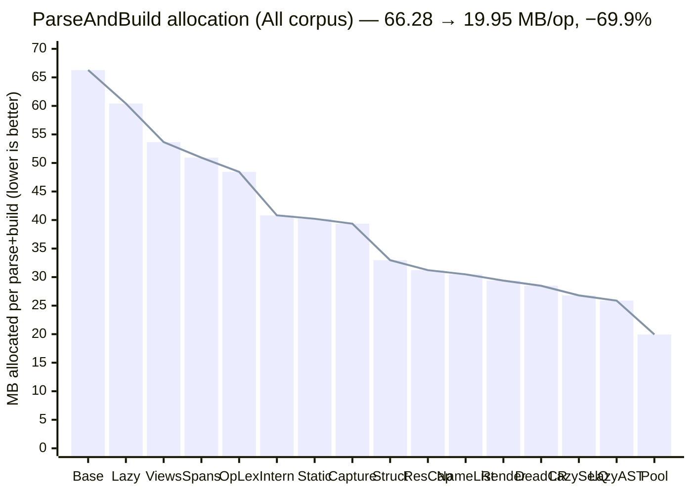
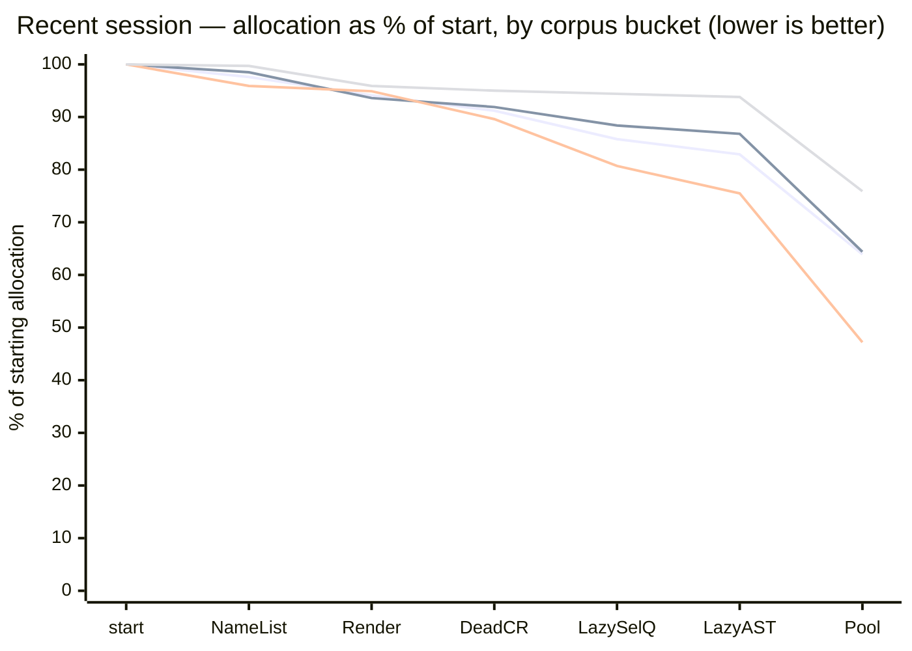

# Parser Performance — Allocation Reduction

**Headline: the pgproj parser now allocates `19.95 MB/op` to parse + build the corpus, down from `66.28 MB/op` — a `−69.9%` cut in managed allocations across 16 merged optimizations.**

Metric: **BenchmarkDotNet `PipelineBenchmarks.ParseAndBuild` allocated bytes/op (MB, lower is better)** over a corpus of PostgreSQL DDL/DML. Allocation is the deterministic, reportable number; wall-clock is omitted as noise (see [Caveats](#caveats)).

---

## 1. The full journey — "All" corpus bucket

Every merged optimization, in order. Allocation falls monotonically from baseline to the ArrayPool win.

> **Two efforts in one line.** Wins **1–10 (`Base` → `ResCap`)** were a prior session that took allocation from `66.28` to `31.22 MB/op`. Wins **11–16 (`NameList` → `Pool`)** are the most recent session, taking it the rest of the way to `19.95 MB/op` — an additional `−36.1%` on top of an already-optimized parser. The single biggest step is the final `Pool` win (`25.88 → 19.95`, `−22.9%` in one move).

| Effort | Stages | Start → End (MB/op) | Reduction |
|---|---|---:|---:|
| Prior session | `Base` → `ResCap` (1–10) | 66.28 → 31.22 | −52.9% |
| **Recent session** | `NameList` → `Pool` (11–16) | 31.22 → 19.95 | **−36.1%** |
| **Total** | `Base` → `Pool` (1–16) | **66.28 → 19.95** | **−69.9%** |

---

## 2. Recent session across all four corpus buckets

The last six wins (11–16) improved **every workload shape**, not just the aggregate. To compare four series whose absolute magnitudes differ by ~10× (`All` ≈ 31 MB vs `Table` ≈ 3 MB), the trends are normalized to **% of each bucket's starting allocation** — so all four start at 100% and the slope is the win.

**Series (top to bottom at the `Pool` endpoint): `Table` 75.9% · `Raw` 64.4% · `All` 63.9% · `Select` 47.2%.** GitHub's `xychart-beta` does not render a legend, so the series are identified here and in the absolute table below. `Select` benefits most (lazy clause lists + pooling hit it hardest); `Table` is already lean so it moves least.

Absolute MB/op behind the normalized chart:

| stage | All | Raw | Select | Table |
|---|---:|---:|---:|---:|
| start (#10) | 31.22 | 19.25 | 11.09 | 3.20 |
| NameList | 30.48 | 18.97 | 10.64 | 3.19 |
| Render | 29.39 | 18.01 | 10.52 | 3.07 |
| DeadCR | 28.48 | 17.70 | 9.94 | 3.04 |
| LazySelQ | 26.79 | 17.02 | 8.95 | 3.02 |
| LazyAST | 25.88 | 16.71 | 8.37 | 3.00 |
| **Pool** | **19.95** | **12.40** | **5.23** | **2.43** |
| **Δ vs start** | **−36.1%** | **−35.6%** | **−52.8%** | **−24.1%** |

---

## 3. Optimization reference

Each tag in the charts, the change it represents, and the resulting "All" allocation.

| # | Tag | Optimization | All MB/op |
|---|---|---|---:|
| 1 | `Base` | pre-grammar baseline | 66.28 |
| 2 | `Lazy` | lazy `SourceText` rendering | 60.41 |
| 3 | `Views` | per-statement `TokenSegment` views | 53.66 |
| 4 | `Spans` | `params ReadOnlySpan` matchers | 50.93 |
| 5 | `OpLex` | `OperatorLexer` in-place merge | 48.44 |
| 6 | `Intern` | per-file token interning | 40.82 |
| 7 | `Static` | static keyword/type interner | 40.22 |
| 8 | `Capture` | capture helpers → `RenderRange` | 39.36 |
| 9 | `Struct` | `Token` → readonly record struct | 32.97 |
| 10 | `ResCap` | residual capture-helper migration | 31.22 |
| 11 | `NameList` | name-list handover (no `AddRange` copy) | 30.48 |
| 12 | `Render` | `string.Create` render (no `StringBuilder`) | 29.39 |
| 13 | `DeadCR` | drop dead `ColumnRef.Parts` list | 28.48 |
| 14 | `LazySelQ` | lazy `SelectQuery` clause lists | 26.79 |
| 15 | `LazyAST` | lazy lists across AST nodes | 25.88 |
| 16 | `Pool` | `Token[]` `ArrayPool` pooling | 19.95 |

Rows 11–16 are the most recent session.

---

## Caveats

- **Values are measured BenchmarkDotNet allocated bytes/op**, converted to MB. Each journey point (§1) is that round's post-merge **"All"** number.
- **The `Pool` point is the warm-pool `ParseAndBuild_Pooled` measurement** — a real multi-file build with the `ArrayPool` already populated, not a synthetic micro-benchmark.
- **Wall-clock is intentionally not charted.** ShortRun timings are noisy and unreliable for trend tracking. For context only: several of these wins were also ~5% faster in wall-clock, with large Gen2-collection reductions — but allocation is the metric we hold ourselves to here.
- **Allocation ≠ working set.** Lower bytes/op reduces GC pressure and Gen2 collections; it is not a direct memory-footprint or throughput guarantee.
